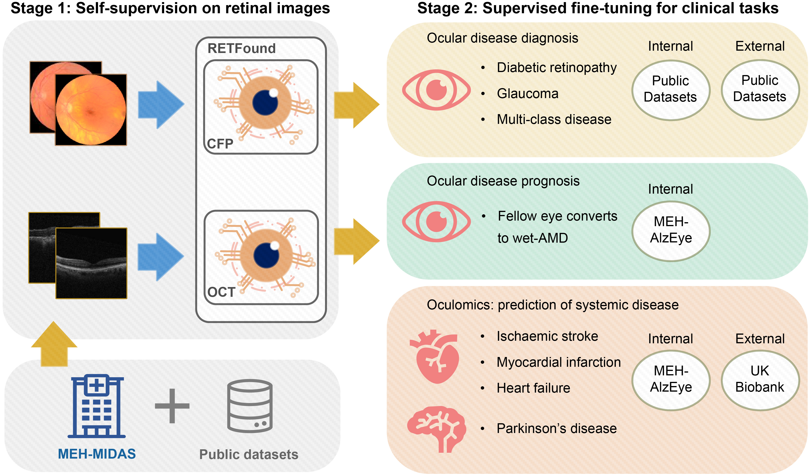

# RETFound - A foundation model for retinal imaging
<!-- select Model and/or Data and/or Code as needed>
### Welcome to OpenMEDLab! 👋

<!--
**Here are some ideas to get you started:**
🙋‍♀️ A short introduction - what is your organization all about?
🌈 Contribution guidelines - how can the community get involved?
👩‍💻 Useful resources - where can the community find your docs? Is there anything else the community should know?
🍿 Fun facts - what does your team eat for breakfast?
🧙 Remember, you can do mighty things with the power of [Markdown](https://docs.github.com/github/writing-on-github/getting-started-with-writing-and-formatting-on-github/basic-writing-and-formatting-syntax)
-->


<!-- Insert the project banner here -->
<div align="center">
    <a href="https://"></a>
</div>

---


## Key Features

This is the repo for the paper [RETFound: a foundation model for generalizable disease detection from retinal images](https://www.nature.com/articles/s41586-023-06555-x) led by [Yukun Zhou](https://rmaphoh.github.io/), [Daniel C. Alexander](https://scholar.google.com/citations?user=mH-ZOQEAAAAJ&hl=zh-CN), and [Pearse A. Keane](https://scholar.google.com/citations?user=-7KS8pYAAAAJ&hl=zh-CN):

- RETFound is pre-trained on 1.6 million retinal images with self-supervised learning
- RETFound has been validated in multiple disease detection tasks
- RETFound can be efficiently adapted to customised tasks

## Links

- [Paper](https://www.nature.com/articles/s41586-023-06555-x)
- [Model](https://github.com/openmedlab/RETFound_MAE#:~:text=r%20requirement.txt-,Download%20Model,-ViT%2DLarge)
- [Code](https://github.com/rmaphoh/RETFound_MAE#fine-tuning-with-retfound-weights) 
<!-- [Code] may link to your project at your institute>


<!-- give a introduction of your project -->
## Details

Medical artificial intelligence (AI) offers great potential for recognizing signs of health conditions in retinal images and expediting the diagnosis of eye diseases and systemic disorders. However, the development of AI models requires substantial annotation and models are usually task-specific with limited generalizability to different clinical applications. Here, we present RETFound, a foundation model for retinal images that learns generalizable representations from unlabelled retinal images and provides a basis for label-efficient model adaptation in several applications. Specifically, RETFound is trained on 1.6 million unlabelled retinal images by means of self-supervised learning and then adapted to disease detection tasks with explicit labels. We show that adapted RETFound consistently outperforms several comparison models in the diagnosis and prognosis of sight-threatening eye diseases, as well as incident prediction of complex systemic disorders such as heart failure and myocardial infarction with fewer labelled data. RETFound provides a generalizable solution to improve model performance and alleviate the annotation workload of experts to enable broad clinical AI applications from retinal imaging.


## Dataset Links

- [IDRID](https://ieee-dataport.org/open-access/indian-diabetic-retinopathy-image-dataset-idrid)
- [MESSIDOR-2](https://www.adcis.net/en/third-party/messidor2/)
- [APTOS-2019](https://www.kaggle.com/competitions/aptos2019-blindness-detection/data)
- [PAPILA](https://figshare.com/articles/dataset/PAPILA/14798004/1)
- [Glaucoma Fundus](https://dataverse.harvard.edu/dataset.xhtml?persistentId=doi:10.7910/DVN/1YRRAC)
- [JSIEC](https://zenodo.org/record/3477553)
- [Retina](https://www.kaggle.com/datasets/jr2ngb/cataractdataset)
- [OCTID](https://borealisdata.ca/dataverse/OCTID)
- [UK Biobank](https://www.ukbiobank.ac.uk/)


## Get Started

**Main Requirements**     
> torch==1.8.1  
> pandas==0.25.3  
> timm==0.3.2  
> tqdm  

**Installation**
```bash
conda create -n retfound python=3.7.5 -y
conda activate retfound

cd RETFound_MAE
pip install -r requirement.txt
```

**Download Model**

<table><tbody>
<!-- START TABLE -->
<!-- TABLE HEADER -->
<th valign="bottom"></th>
<th valign="bottom">ViT-Large</th>
<!-- TABLE BODY -->
<tr><td align="left">Colour fundus image</td>
<td align="center"><a href="https://drive.google.com/file/d/1l62zbWUFTlp214SvK6eMwPQZAzcwoeBE/view?usp=sharing">download</a></td>
</tr>
<!-- TABLE BODY -->
<tr><td align="left">OCT</td>
<td align="center"><a href="https://drive.google.com/file/d/1m6s7QYkjyjJDlpEuXm7Xp3PmjN-elfW2/view?usp=sharing">download</a></td>
</tr>
</tbody></table>


**Data Preparation**

Organise your data into this directory structure (using IDRiD as an [example](Example.ipynb))

<p align="left">
  
</p>


**Training**
```bash
python -m torch.distributed.launch --nproc_per_node=1 --master_port=48798 main_finetune.py \
    --batch_size 16 \
    --world_size 1 \
    --model vit_large_patch16 \
    --epochs 50 \
    --blr 5e-3 --layer_decay 0.65 \
    --weight_decay 0.05 --drop_path 0.2 \
    --nb_classes 5 \
    --data_path ./IDRiD_data/ \
    --task ./finetune_IDRiD/ \
    --finetune ./RETFound_cfp_weights.pth
```


**Testing**
```bash
python -m torch.distributed.launch --nproc_per_node=1 --master_port=48798 main_finetune.py \
    --eval --batch_size 16 \
    --world_size 1 \
    --model vit_large_patch16 \
    --epochs 50 \
    --blr 5e-3 --layer_decay 0.65 \
    --weight_decay 0.05 --drop_path 0.2 \
    --nb_classes 5 \
    --data_path ./IDRiD_data/ \
    --task ./internal_IDRiD/ \
    --resume ./finetune_IDRiD/checkpoint-best.pth
```

## 🙋‍♀️ Feedback and Contact

Please contact 	**ykzhoua@gmail.com** or **yukun.zhou.19@ucl.ac.uk** if you have questions.


## 🛡️ License

This project is under the CC-BY-NC 4.0 license. See [LICENSE](LICENSE) for details.

## 🙏 Acknowledgement

The code is based on [MAE](https://github.com/facebookresearch/mae). We thank the authors for releasing the code. We also appreciate the data organisers for sharing their data.

## 📝 Citation

If you find this repository useful, please consider citing this paper:
```
@article{zhou2023foundation,
  title={A foundation model for generalizable disease detection from retinal images},
  author={Zhou, Yukun and Chia, Mark A and Wagner, Siegfried K and Ayhan, Murat S and Williamson, Dominic J and Struyven, Robbert R and Liu, Timing and Xu, Moucheng and Lozano, Mateo G and Woodward-Court, Peter and others},
  journal={Nature},
  pages={1--8},
  year={2023},
  publisher={Nature Publishing Group UK London}
}
```

